# Pacino

A hand-wired wireless split keyboard you print, screw together and solder — no main PCB.
Parametric OpenSCAD case + switch plate, with a build pipeline that produces **real STEP solids**
(via FreeCAD) so everything is editable in Fusion 360 as B-rep geometry, not as a mesh.
If you would rather not hand-wire it, the same design has a **slim build**: an 11.5 mm case around a
reversible PCB that is generated from this model and ready to order — [see below](#the-slim-build-a-real-pcb-115-mm).

Named after (and descended from) the [cheapino](https://github.com/tompi/cheapino), whose column
stagger and thumb-cluster geometry it borrows; hardware-wise it runs a nice!nano-compatible
nRF52840, Kailh hot-swap sockets on Amoeba-King single-key PCBs, and ZMK.

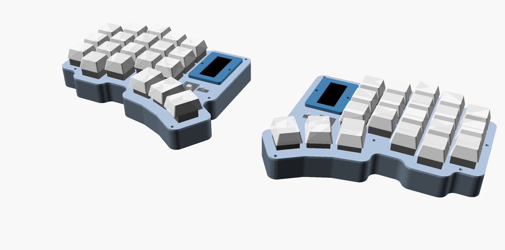

*20 keys per half (40 total): 5 columns + 2 extra keys, with the nice!view display. 145 × 120 mm.*

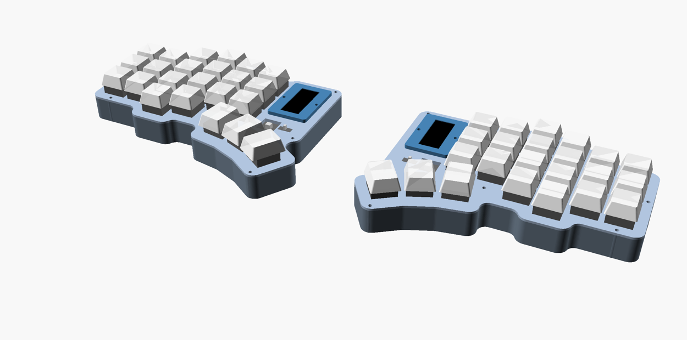

*23 keys per half (46 total): the optional 6th outer column, same display. 164 × 120 mm.*

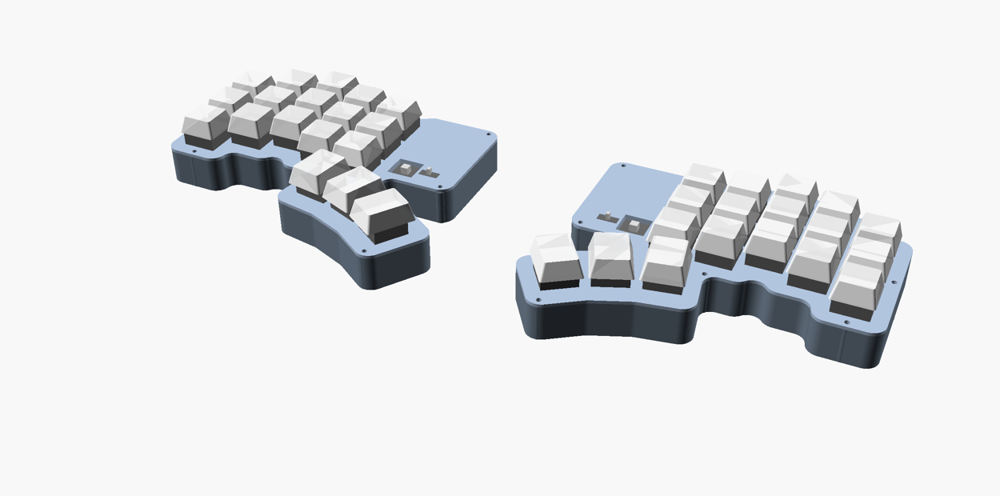

*The minimal build — 18 keys per half (36 total), no extra keys, no display. 145 × 120 mm.*

All three are the same scale. The display costs no width: stacked over the nano, a build with it is
exactly as wide as one without. Renders of every other combination are
[at the bottom](#variant-gallery).

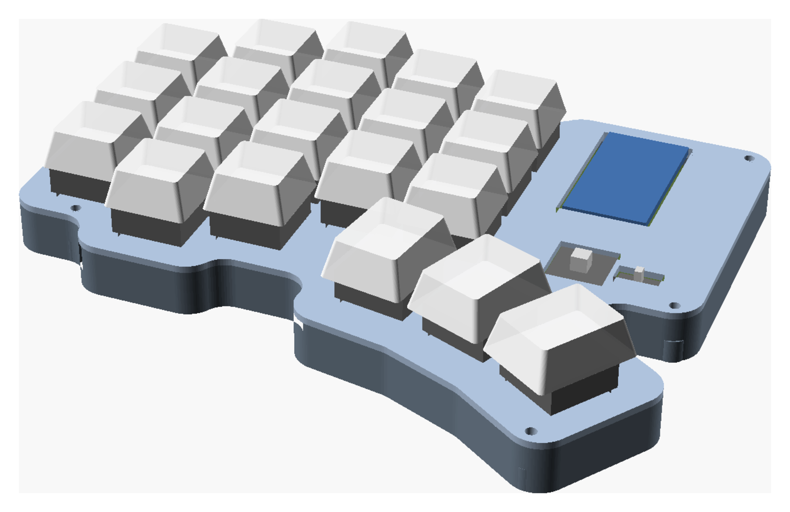

*The slim build: the same 40 keys over a reversible PCB, **11.5 mm** to the plate top instead of 17.5,
and flat — the cell lies in a well under the board. The controller sits flush in the plate window.*

**The default design:** a cheapino-style 3×5 (+2) + 3-thumb column-stagger layout on a clean
19.05 mm **MX** grid with **1.25u thumbs**, an **electronics bay** beside the inner column that
holds a **LiPo** (sunk into a well in the case floor — a 902030 by default), a **nice!nano**
(**flipped component-side down** in a cradle that is part of the plate, fully enclosed, USB out
through a notch in the wall) and a **reset button and power slide switch** in pockets in the
plate, laid out for **hand-wiring**. A **nice!view** mount (flush in the plate *directly over* the
nano, clamped by a screw-down bezel, so it costs no extra width) is in the model but off by default:
mounting bosses live in the walls, not in the matrix, and there is ~3 mm under the switch pins.
A PCB-sandwich build is a switch away.

```
keyboard.scad            the model — all parameters at the top, Customizer-friendly (parts: case, plate, section; bezel with nice_view)
layouts/cheapino.scad    generated from ../cheapino/pcb/cheapino.kicad_pcb  (exact positions, if you want them)
layouts/badtemper.scad   generated from ../badtemper2/BadTemper.kicad_pcb
tools/kicad_layout.py    KiCad .kicad_pcb -> layouts/*.scad  (switches, holes, MCU, Edge.Cuts polygon)
tools/pcb_gen.py         the slim build's PCBs: model -> pcb/*/ boards + footprint libs + gerbers
pcb/flat/  pcb/pod/     those two KiCad projects (generated, DRC-clean; each has its own README,
                         gerber zip and renders).  part = "pcb_test" prints a stand-in to fit first
tools/csg2step.py        OpenSCAD .csg -> STEP, runs inside FreeCAD
tools/svg_polygon.py     helper: bakes the cavity outline to a polygon for the FreeCAD pass
build.sh                 builds everything into out/
out/                     STEP / 3MF / STL / DXF / PNG — regenerate any time, never hand-edit
```

## Pick a ready-made variant

[`variants/`](variants/) holds every combination of the four options — 5 or 6 columns, with or
without the two extra keys, 902030 or 103450 battery, with or without nice!view — each as
`case_*` / `plate_*` STEP + 3MF for both halves (plus a bezel for display versions) and previews.
The index in [`variants/README.md`](variants/README.md) lists sizes; `./build_variants.sh`
regenerates them all.

## Quick start

```sh
./build.sh            # everything: step, mesh, dxf, png  (~40 s)
./build.sh step       # just the STEP files
SCAD_ARGS='-D battery=[34,50,10.5]' ./build.sh    # any parameter override, e.g. the 2000 mAh cell
```

Or open `keyboard.scad` in OpenSCAD and use the Customizer (`Window ▸ Customizer`).
`part` selects what is shown/exported (`assembly`, `section`, `case`, `plate`, the 2D profiles),
`side` picks `left` / `right` / `both`, `explode` lifts the plate.

Outputs per side: `case_*` and `plate_*` as `.step` (Fusion) and `.3mf` / `.stl` (slicer),
`*_2d_*.dxf` profiles for sketches, and `preview_*.png` (assembly, exploded, top, case, plate,
both halves, section through the bay). `WITH_DISPLAY=1 ./build.sh` additionally builds the
nice!view version (`case_display_*`, `plate_display_*`, `bezel_*`); in the Customizer that is the
`nice_view` switch.

## The layout

`grid_stagger = [0, 10, 16.4, 10, 7.5]` is the cheapino's column stagger (its PCB is already
19.0 mm MX pitch) snapped to 19.05. The thumb cluster starts where the cheapino's does
(`71.5, -15.5`) but uses **1.25u caps standing portrait** — long side pointing up at the columns —
fanned −10° / −22° / −34° around the thumb (key rotation = 90° + fan) at a 21.8 mm pitch along
the arc: `[[71.5,-15.5,80,1.25], [92.5,-21.5,68,1.25], [111.7,-31.7,56,1.25]]`. That gives
~1.5 mm between caps at their lower ends (they diverge towards the top, as a radial fan does) and
1.7 mm to the bottom row. Edit `grid_thumbs` to shift or re-fan the cluster; keep the rotation
as 90 + fan so the caps stay portrait.

**Extra keys.** `grid_extra_keys = [[1, -1], [2, -1]]` adds a short fourth row under the ring and
middle columns (under X/C on the left half, ,/. on the right) — 38 keys per pair. `[]` removes them;
any `[column, row]` pair on the grid works.

**Sixth column.** `grid_outer_col = true` adds a column outside the pinky (Corne-style 3×6), with
its own `grid_outer_stagger` (0 = same as the pinky). The left-edge bosses and bumpons follow it; the
half grows to 164 mm wide. Build it alongside the default with
`SUFFIX=_6col SCAD_ARGS='-D grid_outer_col=true' ./build.sh`.

**Hand-wiring.** Eight 6 mm bosses sit 0.5 mm inside the inner wall line so they merge into the
wall and the whole matrix area is free for diodes and wires (each boss was checked for ≥ 2 mm to
every switch body, ≥ 1 mm to the battery, and clear of the MCU cradle and the keycap footprints
so the screw heads are reachable). Under the plate there are 10 mm: MX body + pins take 8.3 from
the plate top, leaving ~3 mm under the pins. The bay has ~8 mm of floor to the right of the battery and 4 mm below it for routing,
and its open fence end faces the nice!nano.

Set `layout = "cheapino"` or `"badtemper"` to use the exact positions extracted from those
boards instead (`cavity_from = "pcb"` then follows that board's Edge.Cuts).

## The electronics bay

```
bay_left / bay_top_y = 86.5 / 61   the bay hangs from its top edge (USB at the top); size is automatic
battery_type = "902030"            the cell (902030 / 103450 / 604060 / custom), bottom-left of the bay, in a 3 mm fence
mcu_size   = [18, 33]              nice!nano at the top of the bay over the battery (measured on a SuperMini clone)
nv_pcb     = [14, 36, 1.6]         nice!view, right of the nano, header end down
ctrl_bay_h = 13                    reset + power strip hung below the bay, switches at its right end
```

Stack at the bay with the 902030 (z from the case underside): floor 0–2.5, with the battery well
sunk to 1.2 · battery 1.2–10.7 · 2.8 clearance for the nano's components, which now face down ·
nice!nano PCB 13.5–15.05 · 0.95 air · plate 16–17.5. The 1.3 mm the well recovers pays for the
component clearance the flip costs, so overall height is unchanged. The model warns if the board's
components would hit the battery or the board would hit the plate. `part = "section"` renders the stack as a 2D cut.

`battery_type` picks the cell and sizes the bay and the cavity depth (`cavity_depth = 0` = automatic,
battery thickness + 4): `902030` (20 × 30 × 9, 500 mAh — weeks per charge; 13.5 mm cavity),
`103450` (34 × 50 × 10, 2000 mAh; 45 × 60 bay, 14.5 mm cavity, +1 mm case height and +3 mm width — the bay reaches past the thumb cluster), `604060` (40 × 60 × 6; 10.5 mm cavity),
or `custom` with `battery_custom`. Build the 2000 mAh version alongside the default with
`SUFFIX=_2000mah SCAD_ARGS='-D battery_type="103450"' ./build.sh` → `case_2000mah_*`, `plate_2000mah_*`.

### How the nano and the battery are held

**Battery:** it drops into a **well sunk 1.3 mm into the case floor** (`battery_well_floor`), whose
walls locate it on all four sides; with the plate on, the nano 2.8 mm above it keeps it in the well. Set `battery_well_floor = 0`
instead and it sits on the floor inside a 3 mm printed fence (`battery_fence`, open at the lead end),
which costs 1.3 mm of case height — the well is the default because the flipped nano needs the room.

**nice!nano / nRF52840 clone:** it goes in **upside down** (`mcu_flipped`, the default) — components
and USB connector facing *into* the case, bare PCB back facing the plate. That protects everything on
the board, and because the wires now poke straight down through the pads into the bay, the cradle no
longer needs wire channels along the sides: the plate above it is **solid**, with no opening over the
MCU at all.

It sits in a cradle that is part of the plate: rails on both long sides, open at the USB end,
holding the board four ways —

- **sideways:** five half-round **crush ribs** per rail (`crush_rib`, 0.6 mm proud, centred on the
  pocket wall so nothing bulges outward), narrowing the 18.6 mm slot to **17.4 mm** at the ribs. An
  18.0 mm board goes in with real resistance and shaves them to a custom fit; boards up to ~18.6 mm
  crush them further. Turn `crush_rib` down for a lighter fit, up for a tighter one.
- **from below, far end:** two corner tabs under the outer 0.5 mm of the far edge, with a 10 mm gap
  between them so a SuperMini-style clone's centred reset button stays clear.
- **from below, USB end:** two posts rising from the **case floor** (`mcu_end_post`), which engage
  once the plate is screwed down.
- **from above:** a 6 mm-wide roof pad on the plate over the bare back of the board, leaving it
  0.2 mm of lift.

**To fit it: with the plate off the case, slide the board into the cradle from the open USB end
until it meets the far rail.** To remove it, push it back out through the **4 mm eject hole** in the
far rail. **Set `mcu_size` to your board's real width × length.** Before printing, check your board's
component side is clear where the cradle touches it: the far corners (outer 0.5 mm, either side of
the reset button) and the two USB-end corners.

**Wiring the nano:** solder the wires on what is now the underside — they drop straight into the bay,
no channels or routing needed. The battery leads come up out of the well right below the board.

Setting `mcu_flipped = false` restores the old component-side-up cradle: an opening through the
plate, wire channels along both long edges, and a USB slot that crosses the plate line.

### Reset button and power switch

Plain through-hole parts, both dropped into the plate from above: a **12 × 12 mm tactile switch**
with a tall plunger (reset → nano `RST` + `GND`) and an **SS12D00 slide switch** (power, in series
with the battery `+` to the nano's `B+`). Each pocket is a hole through the plate the size of the
body (+0.2 mm) with a 1.2 mm floor hanging below, with a 3.5 mm square opening around each leg
(`ctrl_leg_hole`) so the legs hang in free air below the floor and a wire can be wrapped and
soldered to them from underneath. The
tactile's body sits 2.3 mm below the plate top so ~1 mm of its 3.3 mm plunger is proud — enough to
press, hard to hit by accident; the slide's 3 mm actuator stands up for your thumbnail. Solder
wires to the legs from below. Nothing can push the parts in (they sit on the floor) and the legs
plus wires keep them from lifting; if you want belt-and-braces, a dab of glue or a 0.1 mm tighter
`ctrl_clearance` does it. `reset_body` / `power_body` / `*_legs` take the dimensions of whatever
switches you actually buy.

They sit in a **control bay** strip hung below the electronics bay (`ctrl_bay_h = 0` sizes it for
the larger switch), placed as high as the battery allows — the pockets reach up into the bay's
battery-free margin — so they stay clear of the thumb keys in both battery layouts, off the battery
(legs and wires hang free below), and add nothing to the bay's width. (The strip spans the full bay width on purpose: a narrower one leaves a pocket
between bay, column 4 and thumb key 2 that the outline smoothing turns into a hole.)

### nice!view

The nice!view has no mounting holes — on a PCB it hangs off its 5-pin header — so here it is
**clamped**. It sits vertically (header end down, the way a Corne shows it) in a pocket through the
plate, resting on two 1 mm ledges under its long edges that hang from a ring below the plate. The PCB
top ends up `nv_preload` (0.15 mm) above the plate top; the printed **bezel** (`part = "bezel"`,
2.5 mm, window sized to the glass) is screwed down onto two 5 mm bosses hanging under the plate with
M2 screws — `nv_boss_hole_d = 1.7` for self-tapping into PETG (works well; 3 mm of engagement), or
3.2 for heat-set inserts — so it clamps the PCB, not the plate. The 12.6 mm opening under the
display leaves the solder pads free. Nothing can come loose without removing two screws, and
nothing relies on a friction or snap fit.

**It sits directly on top of the nano** (`nv_stacked`, the default). That only works because the
board is flipped: the plate above it is solid, so the display can take that surface. The bay then
stays as narrow as the no-display version — the display costs **0 mm of width** instead of 11.6.

Three things follow from stacking, and the model enforces all of them:

- The bezel's screw bosses move from the display's **ends to its sides** — an end boss hangs 3 mm
  below the plate and would pass straight through the board. On the sides they clear the board by
  0.8 mm and the cradle pocket by 0.5 mm, landing in free bay space 2.3 mm above the battery.
- The support ledges are thinned (`nv_ledge_te`, 1.2 → 0.6 mm) so they clear the board's back by
  0.4 mm — and they then double as the board's hold-down, replacing the cradle roof pad that the
  display's opening cuts through.
- The display's wiring end overhangs past the board, so its five wires drop straight into the bay
  and run to the nano's pads, which now face into the bay.

The cost is servicing: getting the nano out means removing the bezel and lifting the display first.
Set `nv_stacked = false` for the old side-by-side bay (11.6 mm wider); it is also the automatic
behaviour if `mcu_flipped` is off, since an unflipped nano needs that plate area for its own opening.

### Bumpons

Eight 10.6 mm × 1 mm recesses in the underside for 10 mm self-adhesive rubber feet (`bumpon_d`,
`bumpon_clearance`, `bumpon_depth`; `bumpon_positions` for the four under the key block and thumb
cluster, two on the left edge follow the outer column, and two are placed on the bay: 8 mm in from
its top-right corner, and 12 mm up from the bottom of the control strip on the right). The floor is
2.5 mm so 1.5 mm remains under each recess.

The two bay feet and the **battery well** compete for the same floor: the well is already 1.3 mm
into it, so a recess over the well would leave 0.2 mm. With a well the cell therefore sits against
the bay's *left* wall (which doubles as the well's side) instead of 5 mm from it, keeping the bay's
right-hand corners clear, and the bay is sized so the top-right foot always fits beside the cell with
a millimetre of wall outside its recess. Each bay foot then moves outward only by what its well
forces — a couple of millimetres — and the model warns if one has nowhere to go. The wider cells pay
for it in width: the 103450's bay is 45 mm instead of 44, and its case 148 mm. A 56.6 mm × 1 mm disc recess for a MagSafe
magnet ring sits under the index column (`magsafe_d`, `magsafe_pos`; 0 = none) — kept clear of the battery well,
since the two cut the floor from opposite sides and would leave 0.2 mm where they overlap (the model warns).
`out/preview_bottom.png` shows them all.

### How the plate attaches

The plate is the lid. The case walls end flush with the plate's underside, so the plate rests on
them all round; a 1 mm lip under the plate drops inside the walls (0.2 mm clearance) and locates it.
Eight 6 mm bosses rise from the floor to the plate underside (six around the key block, two on
the bay's right-hand corners, all half-buried in the wall so they don't intrude on the wiring), each with a
3.3 mm × 5 mm hole for an **M2 × 4 × 3.5 brass heat-set insert** (`boss_hole_d = 1.7` if you'd
rather self-tap). **M2 × 6 screws** go down through the plate into them — the heads sit on top of
the plate, like a tray-mount case (ultra-thin hex-socket heads are ideal).

Hardware per half: 8 × M2×4×3.5 inserts, 8 × M2×6 screws, 8 × 10 mm bumpons
(+ 2 × M2×4 self-tapping screws for the bezel if you build the display version).
`variants/insert_test.3mf` (`part = "insert_test"`) is a two-minute test print — one boss as on the
case and a scrap of plate with its screw hole — to try the insert and screw before printing a case.

### Hot-swap with single-key PCBs

Per-key hot-swap PCBs (amoeba style) work as-is: the Kailh socket and the diode go on the underside
of each little board, the bare top face sits against the switch body, and the board hangs on the
switch — the socket grips the pins (as in any hot-swap board) and 5-pin switches' pegs locate it.
Row/column wires join the boards' `ROW`/`COL` pads underneath, below the ribs.

The classic failure with hanging boards — a switch being inserted pushes the board down instead of
into the socket — is handled by **pillars rising from the case floor** under each board's four
corners (`key_pcb_post = [2.5, 3.2]`, `key_pcb_post_gap = 0.2`). They sit inside the corner notches,
on the bare 1.3 × 2 mm patches the amoeba-king keeps clear of pads and components (its side pad rows
end 5.6 mm off-centre; the pillars start at 6.3), and stop 0.2 mm below the boards, so with the case
closed a board cannot move and a new switch's pins are forced into the socket. To swap a switch,
just pull and push with the case closed; the board stays put.

**Wiring around the pillars.** The pillars hug the *top and bottom* edges of each board (the row
boundaries), 3.5 mm long at ±7 mm from centre, so the column boundaries are completely free and the
centre 10 mm of every row boundary is free too. The amoeba-king's ROW pads are on its left/right
edges and its COL pads at the centre of its top/bottom edges: row wires go straight across the
column boundary pad-to-pad, column wires run down the board centre line between the pillar pairs —
neither comes near a pillar. The only rule: never lay a wire along a board's top/bottom edge into a
corner, because a wire on a pillar patch gets clamped in the 0.2 mm gap when the case closes.
[`docs/wiring_guide.png`](docs/wiring_guide.png) shows the underside with pads, pillars and an
example matrix whose every wire is clearance-checked against every pillar (`tools/wiring_guide.py`
regenerates it, and each variant directory gets its own). Orient the boards with the ROW pads
towards the neighbouring columns (the pillars are sized around that). The bundle to the controller
runs on the floor between the pillar rows.

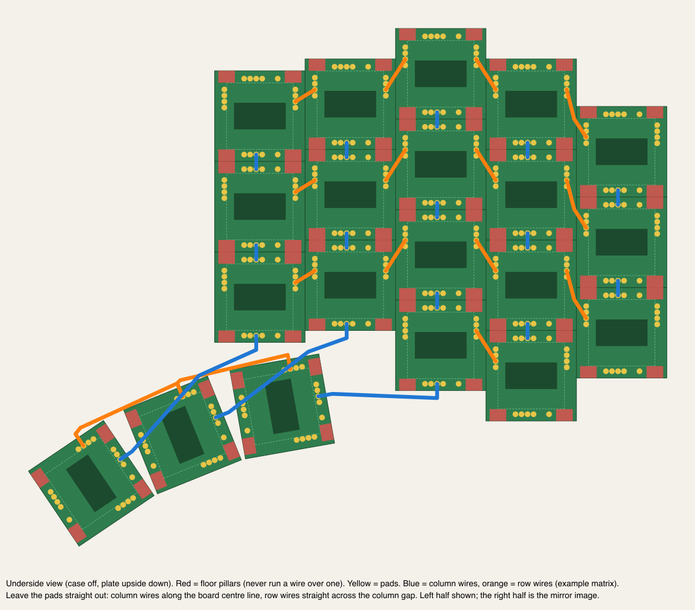
`key_pcbs = true` (default) also stops the ribs 0.3 mm above the boards' top face, since the boards
are wider than the rib cells; set it to false for plain hand-wiring (no boards, no pillars). All of
this is a hand-wired idea — `build = "pcb"` ignores it, and takes its rib depth from the main board.

### Plate stiffness

A flat 1.5 mm PETG plate flexes under typing, and infill/walls can't fix that (it is already
practically solid). The plate therefore carries an **egg-crate of ribs** on its underside:
a 1.5 mm wall around every switch, 3.2–3.5 mm tall (down to the switch-body bottom, or 0.3 mm above
per-key PCBs, or the main board on the slim build), 0.3 mm outside the switch's clip zone, merging
into a grid (`plate_ribs`, `rib_w`, `rib_h`). That is roughly 5× the bending stiffness of the flat plate
at no change in case height — the ribs sit beside the switch bodies, above the pins, so wiring and
diodes (which live below the pins) are unaffected. The ribs are kept clear of the bosses and the
lip. Print the plate in 100 % infill anyway; a PLA plate with a PETG case is also a fine
combination (PLA is ~70 % stiffer than PETG).

### Printing (PETG)

- **Case:** prints as-is, bosses up. Nothing overhangs except the open-top USB slot (bridged by the
  plate, so it can stay open) and the 1 mm bumpon recesses on the first layer.
- **Plate:** print top-side down. The cradle, the switch pockets (and the display ring and bezel
  bosses, if enabled) then point up and need no support; the keycap side gets the smooth first
  layer. The cradle's crush ribs run the full rail height, so they print as part of the rail
  perimeter. The only overhangs are the cradle's far corner tabs, the roof pad over the board and
  the pocket floors (tiny, fine in PETG).
- **Bezel** (if used): window side down.
- PETG tolerances: pockets have 0.2–0.3 mm clearance, the plate lip 0.2 mm; if your printer runs
  tight, bump `mcu_clearance` / `ctrl_clearance` to 0.4 and `lip_clearance` to 0.3. The MCU cradle
  is deliberately an interference fit — tune `crush_rib` (0.6) rather than the clearances. Self-tapping M2
  into 1.7 mm holes is a good fit for PETG; heat-set inserts also work in the 5 mm bosses.

### What sets the size

Per half (case outline), against the Bad Temper:

| | width × height |
|---|---|
| Bad Temper (choc, printed case) | 122 × 94 |
| badtemper2 MX PCB + 2 mm case | 131 × 107 |
| this (default, no display) | **145.0 × 120.2** (17.5 mm to the plate top) |
| this, with nice!view | 145.0 × 120.2 (the display stacks over the nano) |
| this, slim PCB build | 145.0 × 120.2 (**11.5 mm** to the plate top, flat; or the same with a pod for a 902030) |

Without the display the bay (nano + 902030) is narrower than the thumb cluster, so the **thumb
cluster** sets the right edge (130.5) and the bottom (−51): the cheapino position plus the portrait
1.25u fan is +12 mm lower and ~+12 mm further out than the Bad Temper's 1u thumbs. The display no
longer changes that: stacked over the nano it needs no extra bay width, so both versions are the
same size. (Side by side — `nv_stacked = false` — the nano + nice!view row is 41.2 mm and pushes
the right edge to 142.1: **+11.6 mm**.) Margins (`key_margin` 3,
`wall` 2.4) account for ~2.5 mm per side. A Bad Temper-sized half therefore needs a tighter thumb
cluster, not a different battery.

## Getting it into Fusion 360

1. **STEP (recommended).** `File ▸ Open` / `Insert ▸ Insert Derive` on `out/case_left.step`.
   One solid, true planar faces, real cylindrical holes. Edit with `Press Pull`, fillets,
   `Move Face`, or sketch on a face and cut/extrude; everything after import is in the timeline.
   Volumes are cross-checked against OpenSCAD's mesh on every build (printed by `build.sh`;
   they agree to <0.01 %).
   Note the case outline is a polygon (8 segments per 90° of rounding) because OCC's 2D
   offsetting cannot reproduce OpenSCAD's outline smoothing — see `build.sh`. Holes and bosses
   are exact cylinders.
2. **DXF profiles → fully parametric rebuild.** `Insert ▸ Insert DXF` on the XY plane:
   `cavity_2d`, `case_outline_2d`, `plate_2d`. Extrude the outline to the wall height, cut the
   cavity from `floor_t` up, add bosses at the hole centres. Slower, but you own every dimension.
3. **Mesh fallback.** `Insert ▸ Insert Mesh` with the `.3mf`, then `Mesh ▸ Convert Mesh`
   (Prismatic).

## Build modes and hardware

- `build = "plate"` (default, hand-wired): switches clip into the 1.5 mm plate, 6 mm bosses run
  from the floor to the plate underside with 3.3 mm holes for M2×4×3.5 heat-set inserts
  (`boss_hole_d = 1.7` for self-tappers); M2×6 screws through the plate. `cavity_depth = 10`
  leaves room for MX bodies + pins + wiring and the battery/cradle stack.
- `build = "pcb"`: PCB sandwich, and the slimmest build at **11.5 mm**. Bosses stop at the PCB
  underside, the plate gets spacer bosses down to the PCB, MX plate-to-PCB spacing is automatic
  (5.0 mm MX / 2.2 mm Choc), the MCU sits on sockets on the PCB, the plate gets a window instead of
  the cradle, and the cell either lies flat under the board or rides in a pod on the plate over the
  controller. The boards are in [`pcb/`](pcb/) — see
  [The slim build](#the-slim-build-a-real-pcb-115-mm).
- `switch_type = "choc"` swaps pitch (18 × 17), cutout (13.8), plate thickness (1.3) and heights.
- Wall cutouts: `usb_cutout = [w, h, z-offset-from-board-top]`; `extra_cutouts` for a power
  switch etc. `[x, y, outward_angle, w, h, z]`.

## Using a different PCB or layout

```sh
python3 tools/kicad_layout.py path/to/board.kicad_pcb --prefix mykbd > layouts/mykbd.scad
```

It picks up `SW*`/`K*`/`MX*` switch footprints (position, rotation), mounting holes with
1.9–3.6 mm drills, `U1` as the MCU, and chains `Edge.Cuts` into one polygon. Add an `include`
and a `layout` option in `keyboard.scad` the way `cheapino`/`badtemper` are wired in.

## The slim build: a real PCB, 11.5 mm

`build = "pcb"` turns the same design into a **PCB sandwich**, and the boards exist: [`pcb/`](pcb/)
holds two complete, DRC-clean KiCad 9 projects with gerbers, generated from this model by
[`tools/pcb_gen.py`](tools/pcb_gen.py).

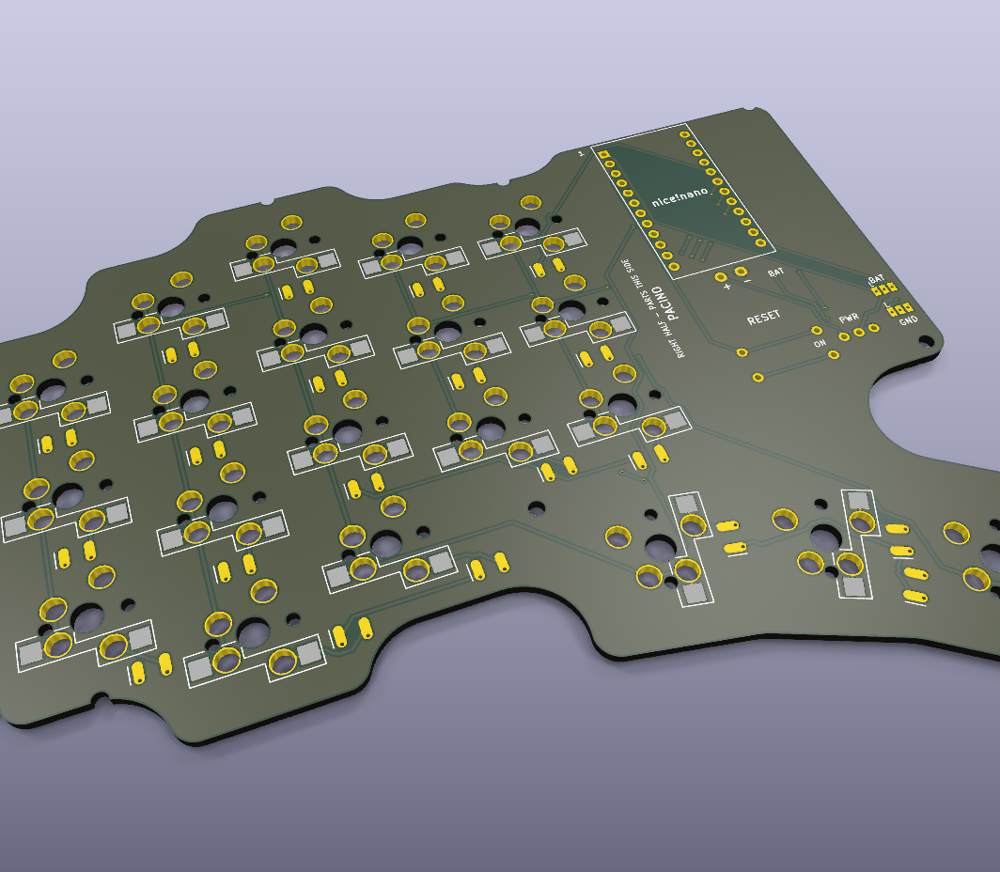

<p>
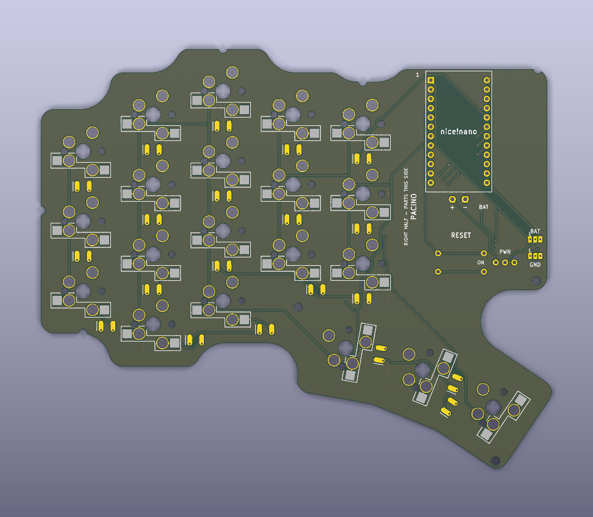
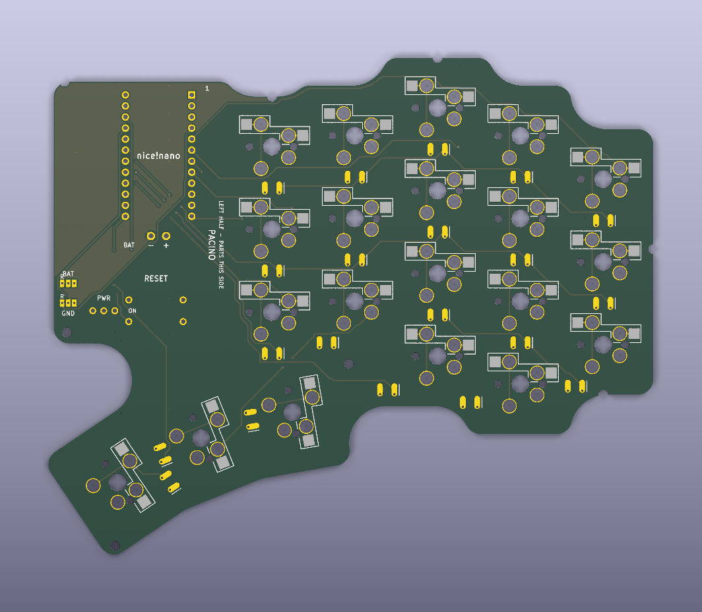
</p>

*The same board from both sides. Flip it over and the bay swaps sides — that is the right half. Each
face's silkscreen names the half you build on it, and outlines its hot-swap sockets the way round
they go in on that half. These renders come out of `tools/pcb_gen.py` with the board, so they are
always the board in the repo rather than a picture of an older one.*

**11.5 mm to the plate top** — the floor for any MX build, and 6 mm thinner than hand-wired. The
stack is 2.5 floor + 2.4 (hot-swap sockets) + 1.6 board + 5.0 (MX plate-to-PCB, fixed by the
switch), and there is nothing left to remove.

Hardware for the slim build: the bosses stop at the board, so they are only 4.9 mm tall and their insert
holes 4 mm deep with 0.9 mm of floor under them — use **M2 × 3 × 3.5 heat-set inserts** (the hand-wired case
takes 4 mm ones) and **M2 × 10 screws** (1.5 plate + 3.5 spacer + 1.6 board + 3 mm of thread). Two 3 mm floor
pillars (`pcb_posts`) stand under the board between the bosses, in the column gaps clear of the sockets,
switch pins and diodes, so a 55 mm span of board is not hanging on its corners; the model warns if one is
moved onto a socket, and the board generator keeps diodes off them.

What sets it is where the cell goes, because **below the board every millimetre of battery is a
millimetre of case**. Above it, the 3.5 mm the MX geometry hands you is free — the socketed
controller already lives there, finishing flush with the plate top, and costs no height at all.
There are two ways to spend that, and both are built:

### Flat — a 303040 under the board (the default)


There is 3.4 mm of unused space under the board in the bay: 1.3 mm of floor well plus the 2.4 mm the
hot-swap sockets need — and the bay has no switches, so nothing is using it. A cell that fits inside
it needs no pod and no cutout in the board. A **303040** (3 × 30 × 40, ~320 mAh) lies in a well in the
floor, the plate stays flat, and the controller sits flush in its window.
Parts: [`variants/5col_extra2_bat303040_pcb_flat/`](variants/5col_extra2_bat303040_pcb_flat/),
board: [`pcb/flat/`](pcb/flat/).

3.4 mm is a cliff, not a slope. A thicker cell has to poke up through the board, and in the bay that
cutout runs straight under the controller and leaves its pin rows with no board to solder to — the
model warns if you ask for it.

### Pod — the 902030 over the controller

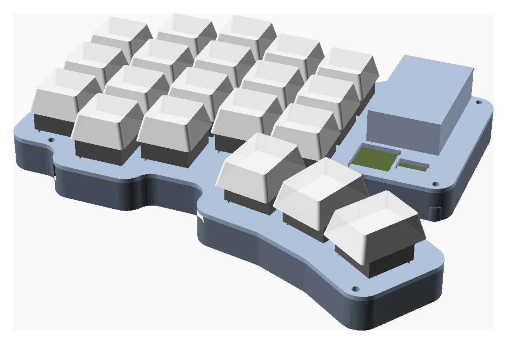

If you want the full 500 mAh, the 902030 rides in a **pod moulded into the plate, directly over the
controller** (`battery_pod = true`): in through the MCU window from below, resting on the controller,
leads down into the bay. Same 11.5 mm case, same outline — the pod stands 11.1 mm proud of the plate,
under the keycaps, which reach 14.5.
Parts: [`variants/5col_extra2_bat902030_pcb_pod/`](variants/5col_extra2_bat902030_pcb_pod/),
board: [`pcb/pod/`](pcb/pod/).

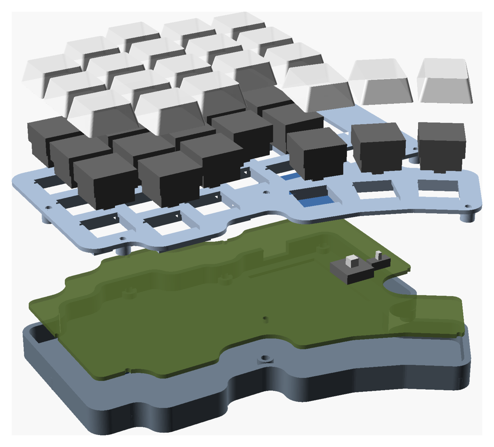

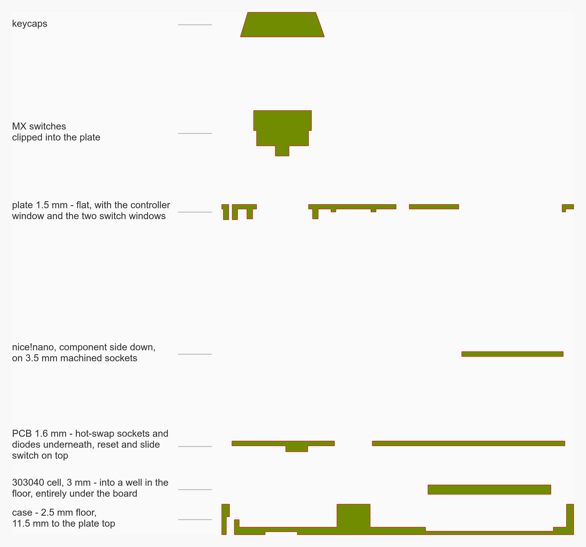

*Every part and where it sits, in the order you assemble it. `part = "section"` cuts the stack at
`section_x` (here 111, through a thumb key and the bay at once); `explode` separates the layers —
case, cell, board, controller, plate, switches, keycaps — each by its own step, so `explode = 0` is
exactly the assembled model.*

### Test-fitting it before you order a board

`part = "pcb_test"` prints a stand-in for the PCB: the real outline and mounting notches at 1.6 mm
thick, every hole a switch's pins, pegs and centre post pass through, the controller's two socket
rows, and the reset and slide switch legs — plus bumps on the underside at the hot-swap socket's real
1.85 mm, so the 2.4 mm under the board is a real test and not an assumption. Both slim variants ship
one as `pcb_test.3mf`; it is reversible the same way the board is, so flip it over for the other half.

```sh
SCAD_ARGS='-D build="pcb"' ./build.sh          # the case and plate
openscad -D 'part="pcb_test"' -D 'build="pcb"' -o pcb_test.3mf keyboard.scad
```

Print it flat, bumps up, then turn it over into the case. It checks the outline against the walls
and bosses, that every switch's pins land in a hole, the plate-to-board spacing, where the controller
and the two switches sit, the cell's room, and the 11.5 mm — everything except the copper. What it
cannot tell you: a printed 1.6 mm sheet is floppier than FR-4, so don't judge flex by it.

### The board

20 keys, 39 nets, ~515 tracks, ~16 vias, two layers, 0.3 mm tracks / 0.2 mm clearance / 0.3 mm
smallest drill — the cheapest process any fab offers. Hot-swap sockets, SOD-123 diodes (a
through-hole 1N4148 fits the same land), the controller on 3.5 mm machined low-profile sockets under the
plate window, reset and slide switch poking up through theirs. The controller gets **bare machined pins**
(Mill-Max 3320 or diode legs) — not a pin header with a plastic body: the board has to sit directly on the
sockets, 3.5 mm + its own thickness putting its back flush with the plate top and its USB receptacle inside
the socket gap. A 2.5–3 mm header body between board and sockets lifts the whole controller by that much and
pushes the USB receptacle up into the plate at the wall. The window around the controller runs right up to the
wall line at the USB end (the receptacle overhangs the board there) and the plate's rim is slotted over the USB
notch, the same 12 mm as the wall, so the port is open from above rather than hidden under a bridge
(`usb_plate_slot`); the window has 2 mm of clearance on the other sides;
`part = "clash"` renders whatever the plate hits — it should be empty. The silkscreen outlines every
hot-swap socket on both faces, so each one goes where its outline is — and because the outlines on
the two faces are the 180° rotation of each other, the way the right half differs is visible on the
board rather than only in the instructions.

The two builds are **two boards**, not one board with an option: moving the cell moves the bay, two
of the mounting holes and the reset/power positions. They are otherwise identical — same matrix,
same footprints, same firmware; only the bay end of the outline and the parts in it differ.

Both are **reversible**: one design, flipped over for the right half. Three things pay for that, and
each board's `README.md` has the detail —

- **Switches** carry *both* MX pin diagonals and a socket land on each face; on the right half they
  go in rotated 180°, which an MX switch does not care about. (Mirroring the pin pair instead — the
  obvious way — puts two 3 mm holes 2.84 mm apart and they merge into a slot.)
- **The matrix** lands on different GPIOs per half, because flipping swaps the controller's two pin
  rows. The ten holes were chosen so both of each hole's pins are usable *and* `pro_micro 1/14/15/16`
  stay free on both halves — the nice!view four. Hence a separate `pacino_pcb` ZMK shield.
- **Power** gets two three-pad solder jumpers (bridge to **L** or **R**). Reset needs none: it sits
  across a pin pair that is GND/RST one way up and RST/GND the other.

```sh
tools/pcb_gen.py                 # both boards, footprint libraries and gerbers
tools/pcb_gen.py --variant=flat  # just one
```

Everything on them comes from `keyboard.scad` — outline, switch positions, mounting holes, controller
and switch placement — so changing the model and re-running moves the boards with it. There is no
schematic file: the generator declares every net and every connection, and names them the way the ZMK
shield does. Each project ships a `*_gerbers.zip` ready to upload; order ten and you have five
keyboards' worth of both halves.

If you would rather draw your own board, the bootstrap files are still there:
[`docs/pcb/pacino_edge_cuts.dxf`](docs/pcb/pacino_edge_cuts.dxf) (the outline for `Edge.Cuts`) and
[`docs/pcb/pacino_placement.csv`](docs/pcb/pacino_placement.csv) (every position in KiCad
coordinates), both from `tools/kicad_placement.py`. `tools/kicad_layout.py` reads a finished
`.kicad_pcb` back so the case can follow the real board.

## Variant gallery

Every option combination, with previews, sizes and download links:
**[variants/README.md](variants/README.md)** — each directory also carries an exploded-style
`preview_assembly.png`, a `preview_top.png` and its own `wiring_guide.png`.

## Firmware (ZMK)

This repo doubles as the ZMK config — no separate zmk-config repo needed. `config/` holds the
`pacino` shield (matrix, transform, default keymap) and `build.yaml` the build matrix; pushing a
change to either makes **GitHub Actions build the firmware** (Actions tab → latest run →
artifacts → `.uf2` files for left, right and `settings_reset`). SuperMini nRF52840 clones flash
as `nice_nano_v2`: double-tap reset, drag the `.uf2` on.

The slim PCB build has its own shield, **`pacino_pcb`** (same layout, same matrix, same keymap):
the reversible board puts the matrix on a different set of GPIOs on each half, so it cannot share
`pacino_left` / `pacino_right`. Both shields are in the build matrix; take the `pacino_pcb_*`
artifacts if you built the board. The pin lists are in
[`pcb/README.md`](pcb/README.md) and `tools/pcb_gen.py` prints them.

Electrical matrix (matches [`docs/wiring_guide.png`](docs/wiring_guide.png)) — 5 columns × 5 rows
per half, diodes `col2row` (Amoeba-King: switch → diode → ROW pad):

| matrix | wires to | nice!nano pin |
|---|---|---|
| row 0 / 1 / 2 | top / home / bottom key row | `pro_micro` 21 / 20 / 19 |
| row 3 | the two extra keys | `pro_micro` 18 |
| row 4 | the three thumbs | `pro_micro` 10 |
| col 0…4 | pinky → inner column (each column chain includes its extra key and thumb) | `pro_micro` 9 / 8 / 7 / 6 / 5 |

Pins 1, 14, 15, 16 are left free on purpose: they are the nice!view's CS/MISO/SCK/MOSI, so the
display variant is wiring + two uncommented lines in `build.yaml` + `CONFIG_ZMK_DISPLAY=y` in
`config/pacino.conf`. Edit your keymap in `config/pacino.keymap`. The left half is the central
side. The shield covers the default 5-column + 2-extra layout; the 6-column or no-extra variants
need a matching edit to the transform and one more column pin.

## Requirements

- OpenSCAD 2025.03+ (Manifold backend) — `/Applications/OpenSCAD.app`
- FreeCAD 1.0+ for STEP — `/Applications/FreeCAD.app` (only for `build.sh step`)
- Python 3 for the tools
- KiCad 9 for the PCB — `tools/pcb_gen.py` runs itself under KiCad's bundled Python (`pcbnew`)
  and uses `kicad-cli` for the gerbers
